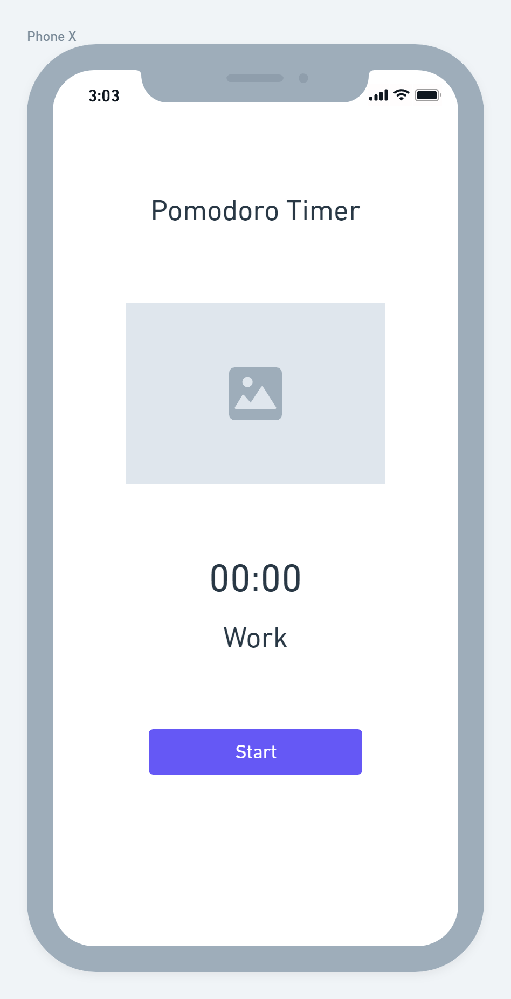

# Pomodoro Timer

# The idea of the app
A Pomodoro timer is a simple application that keeps you focused and productive by scheduling work and break sessions consecutively. Traditionally, you have 25-minute focus sessions followed by five-minute breaks and a longer 15-minute break after four consecutive focus sessions.
# The wireframe

# The way of installation the project to run it locally.
1- Press at the link: [Github Book App repo](https://github.com/GSG-FC03/Book-App). 
2- Click at code button. 
3- Clone the repository to your device. 
4- Open gitBash. 
5- Move to path you want at your device ---> cd (the name of your path - without the braces). 
6- Write ---> git clone (paste the link of the repository - without the braces). 
7- Press Enter to clone it. 
8- Write ---> code. 
9- Open index.html file. 
10- Right-click with the mouse. 
11- Select open with live server. 

# Tech stack and the purpose of it
* Html ➙ To make the structure of the website. 
* Css ➙ To add colors, position ..etc to the elements. 
* JS ➙ To the make the page more interactive. 

# Made by 
- [Aya Alarayshi](https://github.com/Aya74)